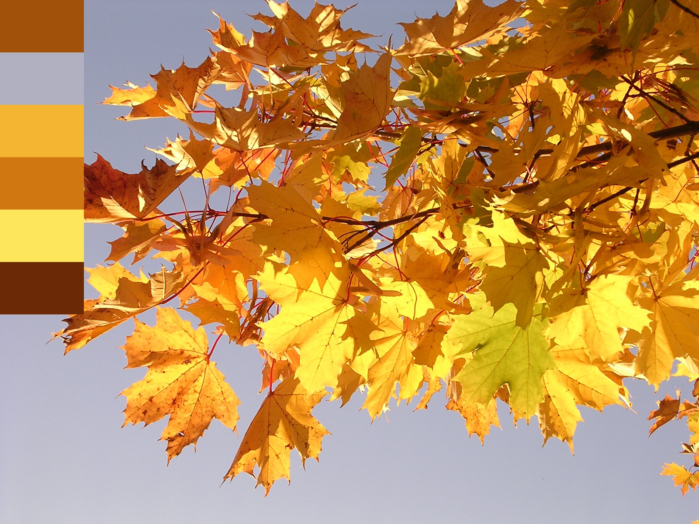

# palettable

### A simple program that creates a color palette for your images.

__________________________________________________________________
## Usage:

From your command line, clone the repository: 
`git clone https://github.com/ljsauer/palettable.git`
or, click on the green "Code" button at the top of the page and click "Download ZIP" 

Again from the command line, install the packages in requirements.txt: 
`pip install -r requirements.txt` 

Run the program, including a path to your image file: 
`python run.py -image <path/to/your/image>` 

Optionally, specify the position, orientation, and size of the palette. Example: 
`python run.py -image myimage.jpg -pos topLeft -orient vert -num 8` 

Output from above example: 
